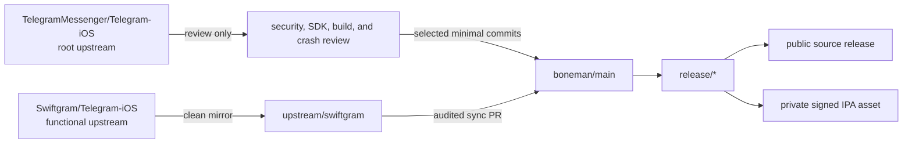
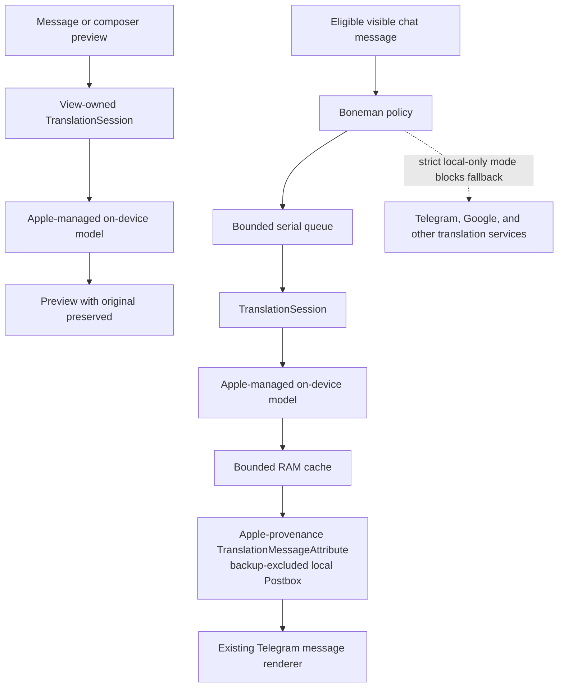
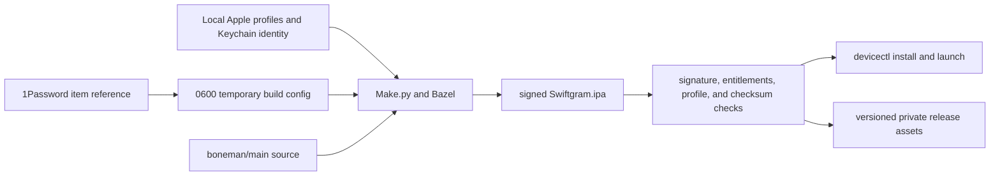

# Architecture

This fork keeps Swiftgram as the functional upstream and Telegram as the root upstream. Boneman-specific behavior stays on `boneman/main`; the clean Swiftgram mirror stays on `upstream/swiftgram`.

## Repository flow

The remote names are part of the maintenance contract:

| Remote | Repository | Role |
| --- | --- | --- |
| `origin` | `Thetromboneman1/Swiftgram-iOS` | Personal fork |
| `swiftgram` | `Swiftgram/Telegram-iOS` | Primary functional upstream |
| `telegram` | `TelegramMessenger/Telegram-iOS` | Secondary root upstream |

`boneman/main` must never be force-updated from either upstream. Scheduled automation updates the clean tracking branch and opens an auditable pull request. Telegram changes are surfaced for review and are never merged automatically.

## Customization boundary

The custom translation policy, cache, and Apple framework integration are isolated from Telegram's networking layer:

The key seams are:

- `Swiftgram/BonemanTranslation`: local-only policy, bounded in-memory cache, and unit-testable decisions.
- `submodules/TranslateUI`: Apple `TranslationSession`, custom preview UI, and session lifecycle.
- `submodules/TelegramCore`: message translation routing and the local-only guard before network code.
- `Swiftgram/SGSimpleSettings`: local backend preference and preferred target language.
- `ChatTranslationState` in `submodules/TranslateUI`: per-chat enablement and target state.
- Existing Telegram UI call sites: individual messages, chat translation, and composer replacement.

Apple framework calls stay in the UI-capable integration layer. `TelegramCore` keeps the routing guard but does not import SwiftUI or UIKit.

A bounded IDs-only Postbox preference index tracks exact Apple-owned attributes so disable, target change, and capacity eviction do not remove Telegram or Swiftgram translations.

## Build and release boundary

Telegram's supported Bazel package is the release boundary. The generated Xcode project is useful for development, but the vendored `rules_xcodeproj` Archive action is not a supported IPA exporter.

The Telegram API ID and hash become compiler definitions and are embedded in the app. Resolved configuration, generated `variables.bzl`, dedicated Bazel caches, archives, signed IPAs, and dSYMs are therefore private credential-bearing build state. Provisioning profiles and private keys are private too. None may enter Git history or GitHub Actions.

## Extension signing set

The full IPA embeds these signed bundles:

| Target | Bundle identifier |
| --- | --- |
| Application | `com.boneman.swiftgram` |
| Share | `com.boneman.swiftgram.Share` |
| Notification content | `com.boneman.swiftgram.NotificationContent` |
| Notification service | `com.boneman.swiftgram.NotificationService` |
| Siri intents | `com.boneman.swiftgram.SiriIntents` |
| Widget | `com.boneman.swiftgram.Widget` |
| Broadcast upload | `com.boneman.swiftgram.BroadcastUpload` |

All active targets use Team `B86H3B6X8P` and App Group `group.com.boneman.swiftgram`. The main target also needs Push Notifications. Managed capabilities that are unavailable to the personal bundle are gated out instead of weakening signing checks.

## Current source references

- Swiftgram base: `cf8b23beaaac4126a396337ac2d5be13f9f76b66`
- Telegram comparison: `6ad963e5b62d354da79040f388ae2b9132fb17b8`
- App version: `12.9.2`
- Minimum application OS: iOS 13.0
- All Boneman Apple translation modes: iOS 18 or newer

The app can still run on its upstream minimum OS. Boneman translation controls are hidden or unavailable when the required Apple API is not present.
