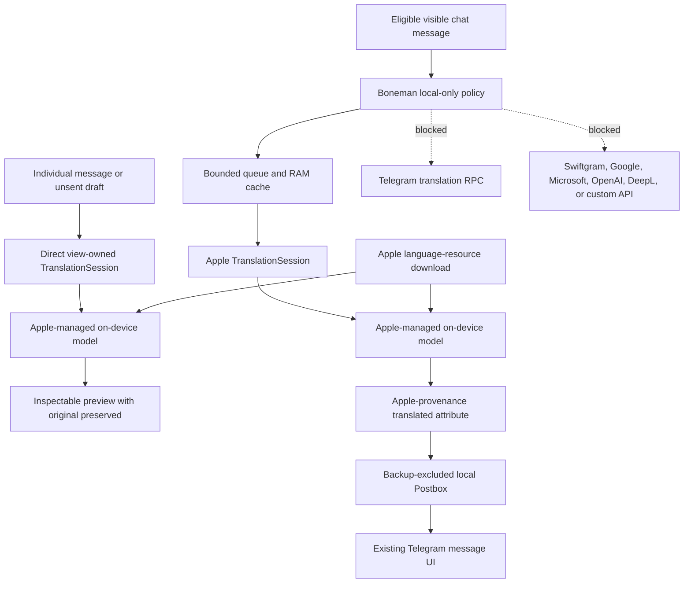

# Translation privacy

## Decision

Boneman translation uses Apple's iOS 18 `TranslationSession` API for message content. It does not intentionally submit that content to Telegram's translation endpoint, Swiftgram, Google, Microsoft, OpenAI, DeepL, or a custom translation service.

The feature does not use Apple's system-wide `translationPresentation` sheet. Apple's current Translation privacy notice says system-wide translation can send text to Apple unless both languages are downloaded. That behavior does not meet this fork's strict no-cloud contract.

## Data flow



Normal Telegram messaging still uses Telegram's network as designed. That is separate from the custom translation operation.

## What leaves the app

For the Boneman `TranslationSession` path:

- Original and translated message content is processed on device.
- Apple states that it may collect the app bundle identifier and source/target language-pair performance information, but not the original or translated content, for Translation API requests.
- Downloading an Apple language model requires network access to Apple.
- Telegram continues to receive messages that the user explicitly sends. Composer translation never sends on its own.

This description is based on Apple's current documentation and privacy notice:

- [Translation & Privacy](https://www.apple.com/legal/privacy/data/en/translation/)
- [Meet the Translation API](https://developer.apple.com/videos/play/wwdc2024/10117/)
- [TranslationSession](https://developer.apple.com/documentation/translation/translationsession)
- [translationTask](https://developer.apple.com/documentation/swiftui/view/translationtask(_:action:))

## Local storage

| Data | Storage | Retention |
| --- | --- | --- |
| Whole-chat work cache | Process memory | Bounded; cleared on app exit |
| Backend and preferred target language | `SGSimpleSettings` local preferences | Until changed or app data is removed |
| Per-chat translation state | `ChatTranslationState` in Telegram's local item cache | Until disabled, changed, or app data is removed |
| Apple-owned message translation attribute | Telegram's local Postbox | Bounded by exact message-ID ownership index; cleared on disable, target change, or eviction |
| Apple-owned message-ID index | Local Postbox preferences | Bounded; contains IDs and ownership metadata, not source or translated text |
| Apple language resources | Apple-managed system storage | Managed by iOS |

Telegram excludes its local account/Postbox directory from device backups. Boneman clearing logic removes only exact message IDs recorded as Apple-owned. Telegram or Swiftgram translation attributes are not part of that ownership set.

## Controls

- `localOnly` requests stop before Telegram's `messages.translateText` RPC.
- The Apple backend does not use Swiftgram's Google translation wrapper.
- Poll, audio, unsupported rich content, empty text, emoji-only text, and URL-only text are filtered before scheduling.
- Source text is checked again before a message attribute is written, so an edited message cannot receive a translation for stale text.
- Cancellation invalidates subscribers and prevents later Postbox writes.
- The outgoing draft is checked again before a translated replacement is applied.
- No new analytics event contains message or translation text.
- The custom module adds no networking dependency or endpoint.

The repository policy check is:

```bash
scripts/check-translation-policy.sh
```

That static check is necessary, but it is not enough by itself. Release validation also includes source review, unit tests, a signed physical-device run, and network/log observation.

## Offline verification status

Offline behavior is not considered verified until both language resources are installed, the iPhone is connected over USB, Wi-Fi and cellular data are disabled, and translations succeed without a network path. A local-network developer connection is not acceptable evidence because disabling Wi-Fi also disconnects the Mac from the device.

Until that test is recorded in the release evidence, offline operation remains unverified. The implementation and Apple's documented API contract support the expectation, but documentation is not a substitute for the physical test.
