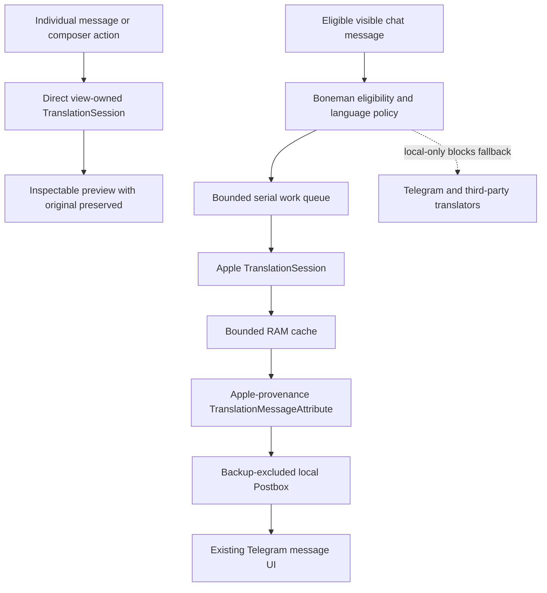

# Apple translation

Boneman translation is a separate local-only path built on Apple's `TranslationSession` API. It requires iOS 18 or newer. Older iOS versions can still run the app, but they do not get a cloud fallback for this feature.

## What it does

### Translate one message

Use the existing message action and choose **Translate**. The app keeps the original message intact and opens a Boneman preview for the translated result. The preview can be copied or dismissed without modifying Telegram's stored message.

### Translate a chat

Enable translation from the chat translation control and choose a target language. The app schedules eligible visible messages as they enter the working window. It does not eagerly translate thousands of historical messages.

The original text remains available. Disabling chat translation or changing the target language cancels outstanding local work before the translated attributes are cleared or replaced.

### Translate before sending

Use the composer translation action. The app translates the current plain-text draft into the selected target language and shows both versions before replacement. It never sends the result automatically. Whole-draft replacement is available only for one plain body paragraph and applies only if the complete structured draft content is unchanged while the preview is open.

Rich composer content, attachments, polls, audio, and other unsupported input stay unchanged.

## Language behavior

- The target language is chosen by the user and remembered in local Swiftgram settings.
- Whole-chat translation detects the source of each message locally, then gives Apple an explicit
  source/target pair. This lets `TranslationSession` prepare or download the correct model while
  preserving mixed-language chats.
- BCP 47 language identifiers keep meaningful script and region subtags. For example, Simplified and Traditional Chinese remain distinct.
- A same-language source and target is treated as a no-op.
- Empty, whitespace-only, emoji-only, URL-only, email-only, poll, audio, and unsupported rich content is skipped.
- A supported pair whose assets are not installed uses Apple's supported language-resource preparation flow.
- An unsupported pair produces a useful local state. It does not call Telegram or another translator.

Apple recommends more text for reliable language identification. Short or ambiguous text can require retrying with an explicit source language once the UI supports that choice.

## Architecture

The reusable policy and scheduling code is under `Swiftgram/BonemanTranslation`:

| File | Responsibility |
| --- | --- |
| `BonemanTranslationPolicy.swift` | Backend choice, text eligibility, language normalization, and local-only rules |
| `TranslationCache.swift` | Bounded in-memory result cache |
| `TranslationWorkQueue.swift` | Serialized, deduplicated, bounded work with subscriber cancellation |
| `TranslationBoundedIndex.swift` | Bounded ordered ownership index for Apple-generated message attributes |

`SGSimpleSettings` stores the selected backend and preferred target language. `ChatTranslationState` stores per-chat enablement and target state. `submodules/TranslateUI` owns `TranslationSession` and the custom preview UI. TelegramCore routes local-only requests away from Telegram's network translation endpoint. TelegramUI connects the existing message, chat, and composer surfaces to that boundary.



One Apple session action handles one queued source text. Session configuration is not invalidated while its action is active. Duplicate requests share work, while each UI subscriber can cancel independently.

## Provider attribution and failures

The chat translation menu reports the provider selected for the current backend. Apple mode says
that Translation runs on device and never links to Telegram's Cocoon information screen. The Cocoon
attribution remains available only when a non-Apple backend is actually selected.

Apple's `.supported` language status means the pair is available but its model may still need to be
installed. Whole-chat work therefore detects the source before creating the session and calls
`prepareTranslation()` for that explicit pair. iOS owns the language-model consent and download UI.

Unsupported language pairs and Apple session failures are reported to the user. They are not stored
as empty successful translations, and they never fall back to Telegram or another cloud translator.
Blank local attributes left by an interrupted or older failed translation are not considered
complete. Visible messages are retried and a successful Apple result replaces the stale attribute.
Apple whole-chat batches are allowed to finish across the history refresh produced by each result.
Disabling translation or changing its target still invalidates queued work before any stale result
can be written.

## Cache and local state

The work queue's translation cache is in memory. Cache keys include source text, source language when known, and target language. It is bounded and disappears when the process exits.

Whole-chat display also persists translated text in Telegram's local, backup-excluded Postbox so it can render through the existing message pipeline after restart. Boneman attributes carry explicit Apple provenance. A bounded IDs-only ownership index identifies only attributes owned by this feature. Disable, target-language change, and capacity eviction clear only those exact Apple-owned attributes, not Telegram or Swiftgram translations. The index does not contain source or translated text.

No translated-message content is intentionally added to iCloud, shared preferences, analytics, or device backups.

## Testing

The deterministic policy, cache, normalization, deduplication, capacity, and cancellation cases live in `Swiftgram/BonemanTranslation/Tests`.

Run them with:

```bash
scripts/build-local.sh test \
  --test-target //Swiftgram/BonemanTranslation:BonemanTranslationTests
```

Apple Translation runtime behavior is not available in Simulator. A simulator build proves compilation only. Language-pack prompts, real translation results, restart behavior, scrolling performance, and offline operation require the signed app on the physical iPhone.

The release record must keep these states separate:

| Check | Required evidence |
| --- | --- |
| Policy and queue behavior | Executed Bazel tests |
| UI and framework integration | Simulator compile and signed device build |
| English to Spanish and Spanish to English | Physical-device interaction |
| Automatic source detection | Physical-device interaction |
| Missing resources | Apple download prompt on device |
| Offline after download | USB-connected device with network disabled |
| Rapid scrolling and repeated messages | Physical-device observation and logs |
| No translation networking | Policy scan plus device network/log observation |

See [TRANSLATION-PRIVACY.md](TRANSLATION-PRIVACY.md) for the data-flow review.
