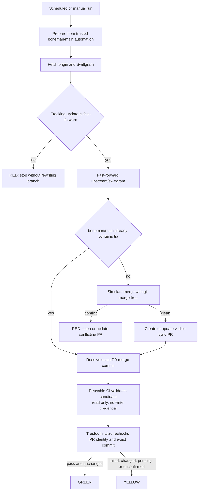

# Upstream synchronization

The automation keeps a clean Swiftgram reference, tests whether it can integrate with the Boneman branch, and leaves the final decision in a pull request. It never force-pushes `boneman/main`.

## Swiftgram sync

`.github/workflows/sync-upstream.yml` runs daily at 11:23 UTC and on `workflow_dispatch`.



The workflow uses:

- `contents: write` to fast-forward only `upstream/swiftgram`.
- `pull-requests: write` to create or update the sync PR.
- No secrets, signing material, or personal Telegram API credentials.
- A concurrency group that prevents two upstream branch writers from running together.

The clean tracking branch is updated only when the old tracking tip is an ancestor of the new Swiftgram tip. An upstream history rewrite is RED and requires review.

The sync pull request uses `upstream/swiftgram` as its head and `boneman/main` as its base. It is never auto-merged. The workflow uses three commit-bound phases: trusted prepare, exact reusable CI with read-only permissions, and trusted finalize. The validator implementation comes from the maintained automation commit, while the candidate source comes from the exact merge commit. Finalize refuses GREEN if the pull request identity or candidate commit changed after validation.

## Drift states

| State | Meaning | Required action |
| --- | --- | --- |
| GREEN | The exact candidate passed repository policy and focused Boneman Translation XCTest, and remained unchanged through finalize | Review the PR, then perform local signed release gates before merging |
| YELLOW | The merge applies, but validation failed, changed, is pending, or was not confirmed | Inspect the exact check or identity mismatch and repair the smallest customization seam |
| RED | Tracking history changed or the upstream merge conflicts | Keep `boneman/main` unchanged and resolve on a separate integration branch |

GREEN does not mean release-ready. Signing or device failure never changes drift to RED. Physical-device launch, language-resource behavior, offline translation, and runtime network inspection remain local release gates.

## Official Telegram monitor

`.github/workflows/telegram-upstream-monitor.yml` runs daily at 13:41 UTC and on `workflow_dispatch`. It compares `TelegramMessenger/Telegram-iOS:master` with `Swiftgram/Telegram-iOS:master`.

The monitor reports:

- Official commits not present in Swiftgram.
- Swiftgram commits not present in official Telegram.
- Commit titles matching security, crash, iOS, Xcode, SDK, Bazel, build, network, MTProto, notification, media, audio, video, or translation signals.
- Changed paths in those areas.
- Official tags absent from Swiftgram.
- GitHub comparison truncation, which forces REVIEW.

It writes one workflow summary and one 30-day artifact containing Markdown and JSON. It does not create an issue for each commit and never merges official Telegram. States are `CLEAR`, `INFO`, and `REVIEW`; every selected patch still needs the PR-audit process.

## CI

`.github/workflows/build.yml` runs on pushes and pull requests targeting `boneman/main`, manual dispatch, and as a read-only reusable workflow for the exact sync candidate.

It has repository-level `contents: read` only and performs two jobs:

1. Repository and translation policy validation on Ubuntu.
2. A focused Bazel XCTest run of `//Swiftgram/BonemanTranslation:BonemanTranslationTests` on macOS. All four expected test classes and a zero-failure aggregate are required.

External actions are pinned to full commit SHAs. The policy job rejects unpinned actions, `pull_request_target`, write-all permissions, workflow secret references, tracked local build input, tracked IPA output, bad submodule state, and translation-boundary network references.

The tracked root `AGENTS.md` symlink points to a Swiftgram-maintained path that is absent from this checkout. CI acknowledges that one exact upstream defect and fails on any other broken tracked symlink.

## Dependency updates

`.github/dependabot.yml` checks GitHub Actions monthly, groups minor and patch updates, and limits open pull requests to three. It does not attempt to update Telegram's pinned Bazel modules, vendored third-party sources, or submodule commits.

## Manual checks

Run the same local policy checks before pushing:

```bash
actionlint
shellcheck scripts/ci-*.sh scripts/check-*.sh
yamllint .github/workflows .github/dependabot.yml
scripts/ci-validate-repository.sh
```

Dry-run the Swiftgram classifier without pushing:

```bash
CI_SYNC_DRY_RUN=true \
GITHUB_REPOSITORY=Thetromboneman1/Swiftgram-iOS \
TARGET_BRANCH=boneman/main \
TRACKING_BRANCH=upstream/swiftgram \
UPSTREAM_BRANCH=master \
UPSTREAM_URL=https://github.com/Swiftgram/Telegram-iOS.git \
scripts/ci-sync-upstream.sh
```

A dry run without an explicit validation result reports YELLOW / NOT CONFIRMED. It cannot establish GREEN.

Generate the current official Telegram comparison locally:

```bash
GH_TOKEN="$(gh auth token)" \
python3 scripts/ci-monitor-telegram-upstream.py \
  --swiftgram-repository Swiftgram/Telegram-iOS \
  --telegram-repository TelegramMessenger/Telegram-iOS \
  --report /tmp/telegram-upstream-report.md \
  --metadata /tmp/telegram-upstream-report.json
```

Do not put a long-lived personal token in the repository. The scheduled workflows use the scoped GitHub Actions token.
